# 机器人集中管理调度平台：架构与功能规范

## 1. 文档目的与适用范围

本规范定义机器人集中管理调度平台的目标架构、领域边界、功能契约、数据权威性、接口和安全约束。它适用于接入 Autoware/ROS 2、通用 ROS 2、Apollo Cyber RT 与存量 ROS 1 的车辆或移动机器人。

本规范不记录实施进度、排期或完成状态；这些信息唯一记录在 [implementation-progress.md](implementation-progress.md)。

平台由六个相互隔离的数据面组成：

1. **安全控制面**：接管、租约、fencing、急停、最小风险动作和控制回执。
2. **车辆运行面**：车辆登记、遥测、告警、健康、任务与运行状态。
3. **媒体面**：相机、WebRTC、录像、媒体授权和流健康。
4. **资产面**：点云、地图、路线、日志、录像和版本化发布包。
5. **运维维护面**：结构化诊断、远程工作空间、文件、终端、图形应用和审计。
6. **身份与治理面**：组织、用户、设备、证书、权限、审计、配置、可观测性和部署。

## 2. 不可违反的架构约束

| 编号 | 约束 |
|---|---|
| ARC-001 | 车辆最终控制裁决只能由车端 `Safety Arbiter` 作出；云端、浏览器、MQTT Broker、WebSocket、Redis、边缘中继均不得绕过它。 |
| ARC-002 | 所有控制指令必须带车辆 ID、控制会话、租约 ID、fencing token、单调序号、TTL、追踪 ID 和端到端认证信息。缺少任一安全字段时车端必须拒绝。 |
| ARC-003 | 任何连接中断、租约超时、心跳超时、端到端信息年龄超限、配置不匹配或安全策略异常，都必须在车端触发最小风险动作；不得由浏览器“解除”。 |
| ARC-004 | PostgreSQL/PostGIS 是业务事实的唯一权威来源。Redis、进程内缓存、浏览器状态与消息 Broker 都只能做缓存或传输。 |
| ARC-005 | 视频、终端、点云、车辆、控制设备、地图和任务未接入时，前端必须明确显示“未接入/不可用/数据过期”，不得生成或保留任何伪造内容。 |
| ARC-006 | 身份必须区分人、车辆、Gateway、控制设备、服务和 API Key；不得使用固定管理员、默认车辆、演示账号或共享开发证书作为运行时身份。 |
| ARC-007 | 所有跨安全边界的协议都必须有明确版本、认证、大小上限、超时、幂等规则、审计追踪和失败行为。 |
| ARC-008 | 控制、遥测、媒体、资产传输和远程维护必须使用独立通道；一个通道的拥塞或故障不得提升其他通道的权限或改变安全策略。 |
| ARC-009 | 所有关键状态变化必须可审计：身份、授权、接管、急停、任务、地图发布、终端会话、诊断、配置、证书和软件版本。 |
| ARC-010 | 生产运行路径不得依赖 mock、演示数据、假摄像头、假终端、固定车辆、浏览器本地状态或无持久化回退。测试夹具只能位于 `tests/`，且不可被部署入口调用。 |

## 3. 总体逻辑架构

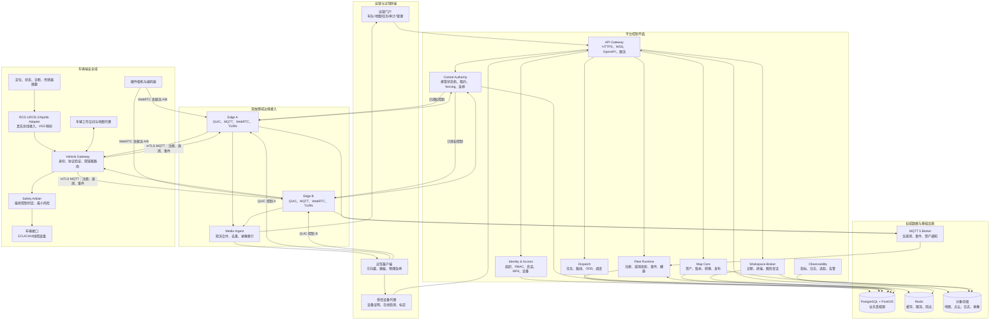

## 4. 代码域与职责边界

| 代码域 | 目标职责 | 对外契约 | 禁止承担的职责 |
|---|---|---|---|
| `protocols/` | Protobuf、VSS overlay、OpenAPI、兼容矩阵、版本演进 | 生成代码、schema 校验、兼容性报告 | 业务状态、车辆控制实现、临时 JSON 私有字段 |
| `vehicle/adapters/` | ROS 1、ROS 2、Apollo 的真实总线适配 | 标准化车辆状态、能力、受控执行接口 | 云端认证、租约签发、伪造传感器或控制回执 |
| `vehicle/gateway/` | 车辆身份、mTLS、协议验证、通道路由、缓存与转发 | 上行注册/遥测/事件，受控下行命令 | 最终安全决策、浏览器服务、固定车辆身份 |
| `vehicle/safety-arbiter/` | 控制授权、限幅、状态机、ODD、看门狗、最小风险 | `ControlAck`、真实执行状态 | 依赖云端在线、业务任务调度、UI 逻辑 |
| `vehicle/media-agent/` | 真实摄像头、硬件编码、媒体贡献流、时间戳 | WebRTC/RTP 贡献流和健康状态 | 画面合成替代真实摄像头 |
| `vehicle/workspace-agent/` | 反向维护通道、诊断代理、受限命令执行 | 短期凭证、审计事件、会话流 | 本地裸 TCP 暴露、无审计 shell |
| `server/fleet/` | Go 模块化控制平面入口和领域模块 | REST、WSS、MQTT 消费、数据库事务 | 绕过车端直接控制、无状态回退 |
| `server/fleet/durable_authority.go` | 可持久化的控制权领域服务 | 租约、fencing、急停、控制授权 | 车辆最终执行、固定单车内存状态 |
| `server/media-control/` | 媒体目录、授权、录像索引、SFU 集成 | 流会话与访问令牌 | 伪视频、浏览器 canvas 替代视频 |
| `server/map-service/` 与 `server/map-workers/` | 资产校验、转换、索引、版本、发布 | 地图包与转换报告 | 修改原始资产、无版本覆盖 |
| `web/ops-dashboard/` | 真实状态呈现和受权操作入口 | REST/WSS/WebRTC | 模拟状态、隐式降级、前端安全裁决 |
| `client/` | 受信远驾客户端与控制设备 SDK | 双链路控制、设备证明、回执显示 | 演示车辆、默认租约、默认边缘地址 |
| `tests/` | 单元、集成、安全、弱网、HIL、仿真测试 | 可重复测试报告 | 生产部署、运行时数据来源 |
| `deploy/` | 生产与开发部署清单、密钥引用、监控 | 容器、Kubernetes、IaC、运维手册 | 启动假车、内嵌演示数据或开发私钥 |

## 5. 功能目录

### 5.1 身份、组织与访问控制

| 功能 ID | 功能 | 实现边界与规则 |
|---|---|---|
| IAM-001 | 组织与项目分组 | 组织、项目、车辆、用户和控制设备均有可验证归属；跨分组数据默认拒绝。 |
| IAM-002 | 人员账号 | 支持账号密码、企业 OIDC/SAML、MFA、账号锁定、密码轮换、会话失效和账号禁用。密码只存强哈希。 |
| IAM-003 | 角色权限 | 平台管理员、组织管理员、调度员、远驾驾驶员、维护人员、审计员、只读用户和外部 API 服务账号分别授权。 |
| IAM-004 | 车辆与 Gateway 身份 | 车辆、Gateway 与边缘服务使用独立 X.509/mTLS 身份；证书包含唯一主体、有效期、撤销状态和轮换记录。 |
| IAM-005 | 控制设备身份 | 方向盘、踏板、急停盒等设备须登记序列号、固件、标定、操作者绑定和受信代理在线证明。设备离线、失配或未标定时拒绝接管。 |
| IAM-006 | API Key 与服务身份 | API Key 只保存哈希，具备最小 scope、车辆白名单、来源 IP/网络限制、有效期、撤销和审计。 |
| IAM-007 | 审计 | 登录、失败登录、授权变更、设备绑定、接管、急停、任务、地图、终端、诊断、证书、配置和 API 调用均产生不可篡改审计记录。 |

### 5.2 车辆登记、能力与生命周期

| 功能 ID | 功能 | 实现边界与规则 |
|---|---|---|
| VEH-001 | 车辆主数据 | 保存车辆 ID、VIN/资产号、车型、底盘、所属组织、ODD、运行区域、责任人和生命周期状态。 |
| VEH-002 | Gateway 注册 | Gateway 以 mTLS 连接并提交 `GatewayCapabilities`；平台验证证书主体、车辆绑定、协议版本、兼容矩阵和撤销状态。 |
| VEH-003 | 能力协商 | 控制模式、Adapter、相机、双 Modem、地图、诊断、工作空间和安全模块版本必须被记录并可查询。 |
| VEH-004 | 车辆状态机 | `registered → provisioning → offline → online → degraded → maintenance → quarantined → retired`；安全状态与在线状态独立维护。 |
| VEH-005 | 健康判定 | 基于真实 Gateway 心跳、遥测时效、Adapter 状态、Arbiter 状态、双链路质量、时间同步、媒体和存储健康计算。 |
| VEH-006 | 隔离与吊销 | 证书撤销、版本不兼容、篡改检测、连续安全拒绝或人工隔离会使车辆进入 `quarantined`，并撤销控制资格。 |

### 5.3 车端 Adapter 与 Vehicle Gateway

| 功能 ID | 功能 | 实现边界与规则 |
|---|---|---|
| EDGE-001 | ROS 1 Adapter | 真实订阅/发布 ROS 1 Topic；单位、枚举、坐标系和字段映射由版本化映射文件定义；控制必须先经过 Arbiter。 |
| EDGE-002 | ROS 2 Adapter | 真实 DDS/ROS 2 Topic 接入；支持 QoS、命名空间、坐标系、时间源和诊断 Topic 映射。 |
| EDGE-003 | Apollo Adapter | 真实 Cyber RT Reader/Writer 接入；使用 Apollo Protobuf 与平台协议的版本化映射。 |
| EDGE-004 | 标准信号 | 基础车辆语义使用 VSS，平台扩展使用 `Platform.*`；每个值带质量、采样单调时间和 UTC 审计时间。 |
| EDGE-005 | Gateway 本地接口 | Adapter、Arbiter、媒体、工作空间、地图代理通过受权限控制的本机 Unix socket/gRPC 连接 Gateway；不暴露为公网裸 TCP。 |
| EDGE-006 | 上行传输 | 注册、遥测、告警、诊断摘要和资产通知通过 MQTT 5/mTLS；高频原始数据按资产传输协议处理。 |
| EDGE-007 | 下行传输 | 控制命令经双 QUIC 链路；任务、配置和资产命令经受认证的可靠通道；网关验证信封、身份、大小、版本和过期性。 |
| EDGE-008 | 离线缓存 | Gateway 只缓存有明确上限、加密和过期策略的非安全数据；控制指令不得离线排队重放。 |
| EDGE-009 | 时间与追踪 | Gateway 提供 NTP/PTP 健康、单调时钟和 trace ID 传递；时钟异常降低或禁止相应远驾模式。 |

### 5.4 安全控制、接管与最小风险

| 功能 ID | 功能 | 实现边界与规则 |
|---|---|---|
| CTRL-001 | 控制模式 | 支持直接执行器、目标运动、轨迹和最小风险模式；每个车辆能力与 ODD 显式声明允许集合。 |
| CTRL-002 | 接管准入 | 同时校验操作者资质、组织权限、车辆在线、ODD、地图版本、时间同步、双链路、媒体、控制设备、车辆故障和人工审批策略。 |
| CTRL-003 | 租约 | 一次接管生成车辆专属、操作者专属、设备专属、短期、可撤销的租约；租约生命周期和原因必须落库。 |
| CTRL-004 | fencing | 每次租约更新产生单调递增 fencing token；车端拒绝小于或等于已知 token 的命令。 |
| CTRL-005 | 双链路控制 | 控制端向两个独立运营商/接入点建立两条 QUIC 会话并双发；车端按会话与序号去重，回执携带实际应用时间。 |
| CTRL-006 | 最小风险动作 | 双链路丢失、命令过期、租约失效、ODD 违反、底盘异常、人工急停或安全监控异常时，Arbiter 按本地标定执行减速、驻车、告警等动作。 |
| CTRL-007 | 紧急停车 | 急停请求必须明确指向一辆授权在线车辆；独立权限、二次确认、实时回执和事件审计；解除急停必须由车端安全状态机按受权流程处理。 |
| CTRL-008 | 控制审计 | 记录请求、签发、转发、接受、拒绝、执行时刻、原因、链路、端到端延迟与操作者。 |
| CTRL-009 | 车端限幅 | 速度、加速度、曲率、转向、油门、制动、挡位切换、坡度、地理围栏和碰撞风险均在车端校验；云端仅可配置经审核的策略版本。 |

### 5.5 车队运行、遥测、告警与事件

| 功能 ID | 功能 | 实现边界与规则 |
|---|---|---|
| FLEET-001 | 遥测摄取 | 按车辆、Gateway 和消息类型验证 mTLS 主体、Envelope、schema、重放、大小、频率和质量字段。 |
| FLEET-002 | 状态投影 | 将最新真实信号投影为车辆运行快照；快照必须带来源时间、接收时间、质量、过期判断和版本。 |
| FLEET-003 | 历史数据 | 按信号类别定义采样、分区、保留和聚合策略；原始高频数据不与运营页面直接耦合。 |
| FLEET-004 | 事件规则 | 基于真实状态产生上线、离线、链路降级、模式变化、越界、低电、故障、控制拒绝、地图不匹配和安全事件。 |
| FLEET-005 | 告警处置 | 支持级别、确认、指派、注释、升级、抑制、关闭、证据链接和处置审计。 |
| FLEET-006 | 实时推送 | WSS 只推送当前授权分组的数据；断线重连先全量校准再增量推送；客户端不得以旧快照冒充实时状态。 |
| FLEET-007 | 运行回放 | 以时间轴关联遥测、事件、任务、控制回执、地图版本和视频索引；回放数据与实时控制面严格隔离。 |

### 5.6 任务、路线、调度与 ODD

| 功能 ID | 功能 | 实现边界与规则 |
|---|---|---|
| TASK-001 | 路线建模 | 路线包含起终点、途经点、坐标系、地图版本、速度限制、禁行区域、停靠规则和生效范围。 |
| TASK-002 | 任务定义 | 任务包含目标车辆/车辆池、路线、时间窗、优先级、前置条件、失败策略、操作人和幂等键。 |
| TASK-003 | 调度 | 根据车辆能力、电量、位置、载荷、地图、ODD、维护状态、网络健康与冲突规则选择车辆；调度决策全量审计。 |
| TASK-004 | ODD | ODD 策略版本化定义地理围栏、天气、道路、速度、时间、地图、传感器、链路和自动驾驶能力约束。 |
| TASK-005 | 生命周期 | 任务按 `draft → validated → scheduled → dispatched → accepted → running → paused/failed/cancelled → completed` 迁移；平台的 Broker 投递状态与车辆执行状态分开，只有车辆 ACK 才能进入 accepted/running/completed/cancelled/failed。 |
| TASK-006 | 异常恢复 | 任务失败只可按规则重试、暂停、人工接管或最小风险；不得无条件重复执行动作。 |

#### 导航任务状态与回执边界

导航命令和车端回执使用同一 `Envelope` 身份、TTL、序列与 HMAC 约束，业务载荷为
`platform.v1.NavigationCommand` / `platform.v1.NavigationAck`。`dispatched` 只代表
MQTT QoS1 Broker 接收；它不能被解释为车端已经接受或执行。导航任务的状态迁移由
Fleet 在 PostgreSQL 事务中完成，并与入站 ACK 的单调序列游标、去重账本一起提交：

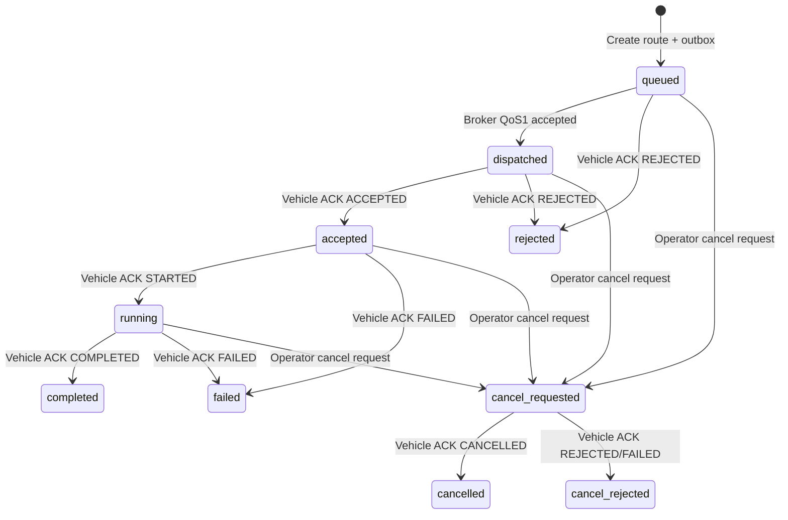

每个 ACK 必须携带任务 ID、车辆 ID、动作、结果、当前完成路点和车端应用时间；
平台拒绝跨车辆 ACK、未知任务、越过终态的回退迁移、超出路点数量的进度以及
低于已提交序列游标的旧回执。取消请求在车端确认前只能展示为
`cancel_requested`，不能提前显示“已取消”。

### 5.7 媒体与视频

| 功能 ID | 功能 | 实现边界与规则 |
|---|---|---|
| MEDIA-001 | 摄像头登记 | 相机 ID、位置、视场、分辨率、帧率、编码、时间戳、隐私区域和健康状态由车辆能力声明。 |
| MEDIA-002 | 贡献流 | 车辆以 WebRTC/RTP/SRTP 向独立边缘接入点推送真实硬件编码流；每条流都带车辆、相机、会话和时间信息。 |
| MEDIA-003 | 双路合并 | 媒体接入按帧号/RTP 序号和时间窗口去重、排序、统计丢包与延迟；单路故障不应伪造、冻结或合成画面。 |
| MEDIA-004 | 分发 | 经 SFU/TURN 向具备权限的浏览器和远驾客户端分发；令牌短期、绑定会话与车辆/相机授权。 |
| MEDIA-005 | 质量门槛 | 控制准入消费真实 glass-to-glass 年龄、帧率、码率、解码失败、关键帧等待和双路健康。 |
| MEDIA-006 | 录像与回放 | 录像分片加密存储，元数据关联车辆、相机、时间、地图版本、任务和事件；可配置保留与导出审批。 |
| MEDIA-007 | 隐私与遮挡 | 支持车牌、人脸、敏感区域处理策略，并审计谁在何时访问了哪些媒体。 |

### 5.8 地图、点云与空间资产

| 功能 ID | 功能 | 实现边界与规则 |
|---|---|---|
| MAP-001 | 资产登记 | 支持 PCD、COPC/LAZ、CSV、Lanelet2、Apollo Map、OpenDRIVE、OpenLABEL 和导航栅格；记录坐标系、校验和、来源、许可和所有者。 |
| MAP-002 | 上传与校验 | 分段上传、恶意文件检测、格式校验、坐标系校验、大小限制、校验和验证和病毒扫描；原始文件永不被覆盖。 |
| MAP-003 | 版本管理 | 地图版本不可变；编辑、转换、标注、发布均产生新版本，记录父版本、操作人、工具版本和转换报告。 |
| MAP-004 | 点云处理 | 进行坐标统一、切片、索引、降采样、浏览器预览、占据栅格转换和空间范围计算；展示降采样必须明确标识。 |
| MAP-005 | 发布 | 发布包绑定车辆类型、坐标系、Adapter/Autonomy Stack 兼容版本、ODD 和回滚版本；车辆确认接收后才可标记生效。 |
| MAP-006 | 编辑 | 支持标注、擦除、禁行区、路线锚点和元数据编辑；编辑不能隐式篡改原始传感器资产。 |
| MAP-007 | 空间服务 | PostGIS 管理空间索引、围栏、轨迹、路线和地图覆盖范围；对象存储保存大文件。 |
| MAP-008 | 发布审批 | `requested → approved → dispatched → confirmed → active`；平台审批只允许进入可靠下行队列，MQTT Broker 接收不等于车辆安装。 |
| MAP-009 | 车端确认 | 车端 Map Agent 通过 `MapPublicationAck` 返回 `ACCEPTED/APPLIED/REJECTED/FAILED`；只有 `APPLIED` 能激活版本，拒绝原因和时间必须持久化。 |
| MAP-010 | 回滚 | 回滚创建新的审计发布记录，显式保存被回滚来源和历史目标；目标版本仍需兼容性校验、审批和车端 `APPLIED`，成功后来源为 `rolled_back`、目标为 `active`。 |
| MAP-011 | 地图格式准入 | 发布前读取车辆已登记 Gateway 能力，要求声明支持目标格式、坐标系和兼容矩阵条目；缺少 Map Agent/能力时拒绝或停留在未确认状态，不生成假 ACK。 |

### 5.9 远程维护、诊断与工作空间

| 功能 ID | 功能 | 实现边界与规则 |
|---|---|---|
| WORK-001 | 维护准入 | 维护会话需要人员权限、车辆权限、车辆状态、审批策略、短期令牌和审计会话 ID；控制与维护权限互相独立。 |
| WORK-002 | 结构化诊断 | 新车辆优先 ASAM SOVD；传统 ECU 通过 UDS/DoIP；所有诊断服务定义、读取、写入和例程调用具备权限与审计。 |
| WORK-003 | 受限终端 | 通过车辆反向安全通道提供短期、受控、可录制的 PTY/SSH；高风险命令需策略、审批或双人复核，不依赖简单字符串黑名单。 |
| WORK-004 | 文件传输 | 文件需清单、哈希、签名、大小限制、恶意扫描、权限、传输进度、过期和审计。 |
| WORK-005 | 图形应用 | RViz/RQt/Gazebo 等在车辆本地运行，经安全图形转发提供；不将 DDS 发现域或 X11 裸露到公网。 |
| WORK-006 | 日志与快照 | 按授权收集系统、Gateway、Adapter、Arbiter、诊断和应用日志；关联故障、任务、车辆和时间范围。 |

### 5.10 管理、配置、开放接口与运营

| 功能 ID | 功能 | 实现边界与规则 |
|---|---|---|
| OPS-001 | 管理控制台 | 管理用户、组织、分组、车辆、证书、设备、角色、ODD、告警规则、保留策略和系统配置。 |
| OPS-002 | 配置发布 | 配置有 schema、版本、审批、差异、签名、回滚和生效范围；安全策略配置须与车辆兼容性绑定。 |
| OPS-003 | 开放 API | 每个接口具有 OpenAPI 定义、版本、认证、scope、幂等、分页、限流、审计和弃用策略。 |
| OPS-004 | Web 运营端 | 提供总览、车辆、详情、告警、地图、路线、任务、视频、驾驶、终端、审计、API 与管理员页面；视图仅显示服务端确认数据。 |
| OPS-005 | 报表与导出 | 报表、导出、录像、日志和地图下载遵守权限、脱敏、审批、水印和下载审计。 |
| OPS-006 | 运行时配置 | 浏览器配置不作为服务器事实；配置变更必须走服务端验证、事务提交和审计。 |

### 5.11 可观测性、可靠性与运维

| 功能 ID | 功能 | 实现边界与规则 |
|---|---|---|
| REL-001 | 指标 | 采集 API、数据库、MQTT、QUIC、媒体、Gateway、Arbiter、控制回执、任务、地图作业和工作空间指标。 |
| REL-002 | 日志与追踪 | 每个跨服务调用传递 trace ID；日志结构化、可检索、脱敏且带保留策略。 |
| REL-003 | 健康检查 | 服务提供 live、ready、dependency、证书和迁移状态；未 ready 的实例不得接收流量。 |
| REL-004 | 高可用 | API/Fleet 可水平扩展；控制 Authority 以数据库事务/锁保障单车辆排他；边缘 A/B 位于独立故障域。 |
| REL-005 | 备份恢复 | PostgreSQL、对象存储、配置和审计具有备份、恢复演练、恢复点与恢复时间目标。 |
| REL-006 | 发布治理 | 镜像 SBOM、签名、漏洞扫描、配置审查、数据库迁移、灰度、回滚与运行后验证。 |

## 6. 关键状态机

### 6.1 车辆运行状态

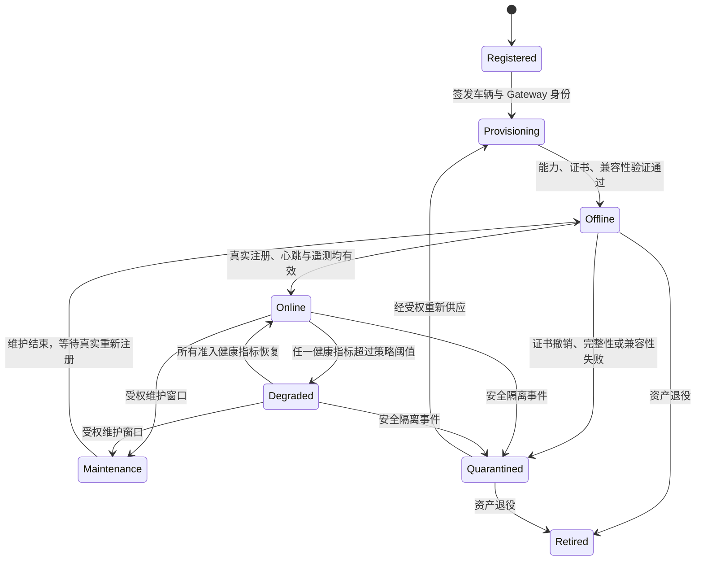

### 6.2 接管与控制状态

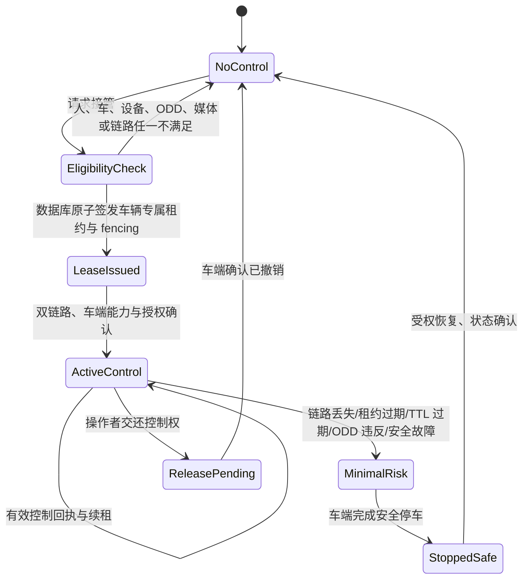

### 6.3 地图资产状态

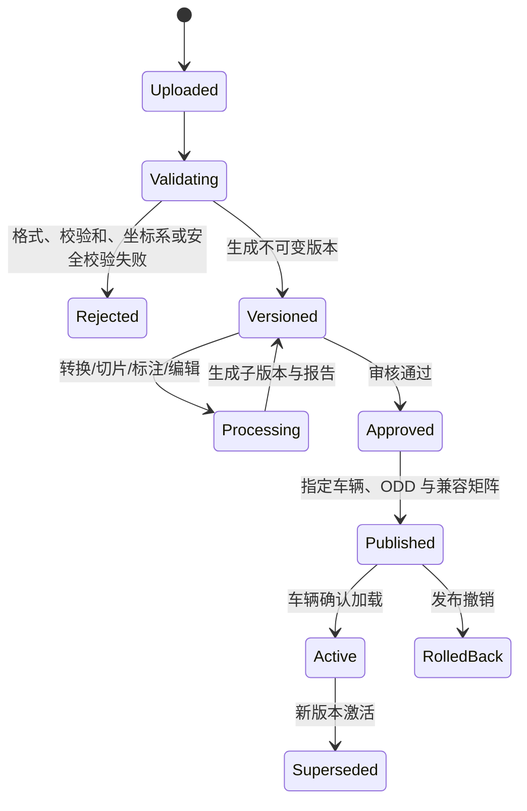

## 7. 核心数据模型

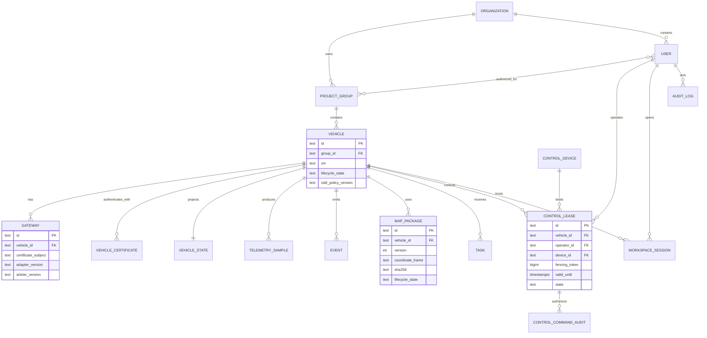

### 7.1 权威表与存储策略

| 领域 | 权威表/对象 | 保留与完整性要求 |
|---|---|---|
| 身份与组织 | `organizations`、`project_groups`、`users`、`roles`、`sessions` | 密码强哈希；会话可撤销；权限变更审计。 |
| 车辆 | `vehicles`、`gateways`、`vehicle_certificates`、`vehicle_capabilities` | 车辆和 Gateway 一对多；能力声明可追溯。 |
| 运行状态 | `vehicle_state`、`telemetry_samples`、`events` | 最新状态带采样时间和质量；历史按分区、聚合与保留策略管理。 |
| 控制 | `control_leases`、`control_commands`、`control_acks`、`emergency_events` | 每次状态转换使用数据库事务；fencing 单调；控制证据不可变。 |
| 任务 | `routes`、`tasks`、`task_transitions`、`odd_policies` | 任务和路线引用精确地图与策略版本。 |
| 地图 | `map_packages`、`map_versions`、`map_publications`、对象存储 | 大文件为内容寻址对象；DB 保存校验和、版本、关联和发布状态。 |
| 媒体 | `media_streams`、`recordings`、`media_access_grants`、对象存储 | 媒体片段加密、带时间轴和访问审计。 |
| 维护 | `workspace_sessions`、`diagnostic_jobs`、`file_transfers` | 每个会话、命令、诊断和文件操作均带审批与审计。 |
| 审计 | `audit_log`、`security_events` | 追加写、访问受限、导出可追踪、按治理策略保留。 |

## 8. 协议与 API 契约

### 8.1 消息层

| 协议 | 用途 | 认证与完整性 | 关键规则 |
|---|---|---|---|
| Protobuf `Envelope` | 所有跨车辆、云端、客户端的业务消息外层 | mTLS 身份 + `auth_tag`/端到端 MAC | `schema_major/minor`、vehicle/gateway/session ID、sequence、单调时间、TTL、trace ID 必填；`auth_tag` 对清空自身后的确定性 Protobuf 字节做 HMAC-SHA256，接收端必须在业务校验前验证。 |
| Protobuf `MapPublicationCommand` / `MapPublicationAck` | 地图版本发布、回滚和车端安装确认 | `Envelope` HMAC + mTLS；ACK 只接受已登记 Gateway 的 Map Agent | Command 只携带不可变版本元数据和内容 SHA-256；`APPLIED` 前平台不得把版本标记为 active；发布/回滚使用独立 publication ID 幂等。 |
| Protobuf `NavigationCommand` / `NavigationAck` | 路线下发、车端导航栈执行和任务状态回执 | `Envelope` HMAC + mTLS；ACK 只接受已登记 Gateway 的 Adapter | Command 携带路线和路点；ACK 的入站序列、去重和路线状态在一个 PostgreSQL 事务中提交；Broker 接收不等于车辆执行。 |
| MQTT 5 | 注册、能力、遥测、事件、状态、资产通知 | mTLS、ACL、按车辆 topic 隔离 | 不承载直接驾驶控制；QoS、retain 和大小上限按消息类别定义。 |
| QUIC Stream | 租约、会话、控制授权、配置确认 | mTLS、端到端控制认证 | 可靠传输、短超时、会话绑定。 |
| QUIC DATAGRAM | 高频控制命令和回执 | mTLS、端到端控制认证 | 双链路双发；TTL 到期即弃；车端去重。 |
| WSS | 运营实时视图、受限终端代理信令 | HTTPS 会话、RBAC、Origin 校验 | 仅可订阅获授权分组；不作为车辆直接控制通道。 |
| WebRTC/SRTP | 视频媒体 | 短期媒体授权、DTLS-SRTP、SFU 策略 | 真实相机流；媒体健康参与控制准入。 |
| HTTPS REST | 运营 API、OpenAPI、资产与配置管理 | Cookie/OIDC 或 API Key + HMAC | schema 校验、幂等、分页、限流、审计。 |

### 8.2 内部服务接口

| 服务 | 命令接口 | 事件接口 | 失败行为 |
|---|---|---|---|
| Identity | `Authenticate`、`Authorize`、`IssueSession`、`RevokeSession` | `IdentityChanged`、`SecurityEvent` | 默认拒绝；不可用时不扩大权限。 |
| Vehicle Registry | `RegisterGateway`、`VerifyCapability`、`QuarantineVehicle` | `VehicleRegistered`、`CapabilityChanged` | 未登记/不兼容/证书失效的车辆不进入在线或控制流程。 |
| Fleet Runtime | `IngestTelemetry`、`ProjectState`、`AcknowledgeEvent` | `VehicleStateChanged`、`EventRaised` | 数据质量异常标记为失效；不保留旧值伪装实时。 |
| Control Authority | `RequestTakeover`、`RenewLease`、`ReleaseLease`、`EmergencyStop` | `LeaseChanged`、`ControlAuthorized` | 事务失败或依赖不满足时拒绝；不得签发内存临时租约。 |
| Dispatch | `ValidateRoute`、`CreateTask`、`DispatchTask`、`CancelTask` | `TaskTransitioned` | 目标车、地图、ODD 不符合时拒绝。 |
| Map Core | `Upload`、`Validate`、`Convert`、`Publish`、`Rollback` | `MapVersionCreated`、`MapPublished` | 原始文件不覆盖；转换失败不发布。 |
| Workspace | `RequestSession`、`StartDiagnostic`、`TransferFile` | `SessionOpened`、`CommandAudited` | 无授权或车辆未注册反向通道时明确拒绝。 |

### 8.3 外部 REST 资源

| 资源 | 主要能力 |
|---|---|
| `/api/auth/*` | 登录、MFA、会话、当前身份、退出、密码与凭证管理。 |
| `/api/admin/*` | 组织、用户、角色、分组、车辆、证书、控制设备、策略管理。 |
| `/api/vehicles/*` | 车辆列表、能力、健康、遥测、事件、媒体目录、维护状态。 |
| `/api/fleet` 与 `/ws/fleet` | 按授权范围获取真实快照和实时增量。 |
| `/api/takeover/*` | 申请接管、设备验证、续租、交还、查询当前租约；所有写入明确携带 `vehicle_id`。 |
| `/api/emergency-stop` | 对单个有权限且在线的车辆触发急停；需要专属权限、二次确认信息和审计原因。 |
| `/api/routes/*` 与 `/api/tasks/*` | 路线、任务、调度、取消、状态和回放。 |
| `/api/maps/*` | 上传、版本、转换、预览、发布、回滚、下载授权。 |
| `/api/media/*` | 相机目录、短期观看授权、录像索引和导出审批。 |
| `/api/workspace/*` | 维护会话、诊断、文件传输、日志收集和审计。 |
| `/open/v1/*` | 对外 API；仅通过 API Key/HMAC、scope 和车辆白名单访问。 |

## 9. 关键数据流

### 9.1 车辆真实遥测流

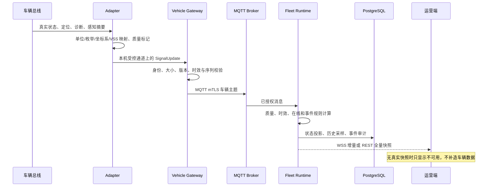

### 9.2 接管控制流

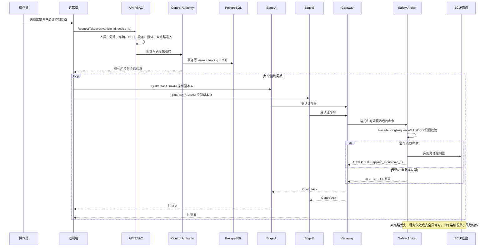

### 9.3 地图资产流

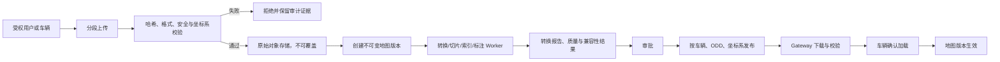

## 10. 安全架构

### 10.1 信任边界

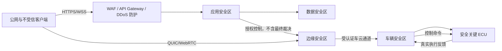

### 10.2 安全控制清单

| 层级 | 必须控制 |
|---|---|
| 浏览器与客户端 | CSP、CSRF、Origin 校验、会话保护、设备证明、敏感操作二次确认、不可将状态作为权威事实。 |
| API | OIDC/MFA、RBAC/ABAC、速率限制、请求大小限制、输入 schema、幂等键、审计、API Key HMAC、来源网络限制。 |
| 服务间 | mTLS、服务身份、最小网络策略、短期凭证、trace ID、超时、重试上限和熔断。 |
| 数据 | 加密传输、静态加密、密钥轮换、备份、访问审计、对象存储签名 URL 和保留策略。 |
| 车云 | 双路 mTLS、证书吊销、topic ACL、QUIC 会话绑定、命令 MAC、TTL、序列、fencing 和回执审计。 |
| 车辆 | Secure Boot/TPM（具备时）、最小权限进程、Unix socket ACL、参数标定签名、独立 Arbiter、看门狗与最小风险动作。 |
| 供应链 | SBOM、依赖漏洞扫描、镜像签名、变更审查、可重现构建、密钥不入库。 |

## 11. 部署拓扑

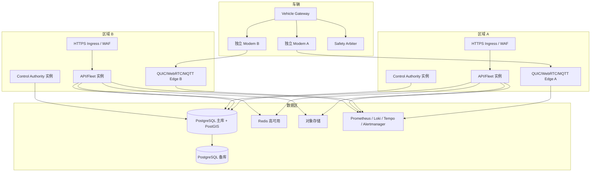

## 12. 无 Mock 运行规则与测试边界

### 12.1 运行时规则

- 生产和本地诊断服务不启动假车、演示脚本、假摄像头、模拟终端或预置车辆。
- 任何运行入口都要求明确的车辆、Gateway、证书、Broker、边缘节点和数据库配置；缺失时拒绝启动或明确报告依赖不可用。
- 前端不生成默认车辆、速度、地图、视频、点云、控制设备、接管状态、短信码或终端输出。
- 未连接的数据源必须返回空的、带原因的结果，不得沿用旧快照冒充当前状态。
- 临时 volatile 模式只能用于明确标识的本地协议诊断；其 API 需要暴露 `non_production=true`，并禁止接管、急停、任务发布和持久身份管理。

### 12.2 测试边界

| 测试类型 | 位置 | 允许的内容 | 禁止内容 |
|---|---|---|---|
| 单元测试 | 各模块测试目录 | 固定输入、测试夹具、时钟替身 | 被生产入口加载。 |
| 集成测试 | `tests/integration/` | 临时数据库、测试 Broker、受控假依赖 | 使用生产证书或外部真实车辆。 |
| 弱网测试 | `tests/netem/` | 丢包、延迟、断链注入 | 作为运行时网关。 |
| 仿真测试 | `tests/simulation/` | 数字孪生、场景、假车 | 任何 `deploy/`、服务 main 或前端运行路径调用。 |
| HIL/SIL | `tests/hil/`、`tests/sil/` | 台架、硬件、封闭场地验证 | 以模拟结果替代道路安全认证。 |
| 安全测试 | `tests/security/` | 越权、重放、fencing、TTL、证书撤销、注入攻击 | 绕过真实安全策略。 |

## 13. 验收标准

| 编号 | 验收条件 |
|---|---|
| ACC-001 | 未登记、证书失效、能力不兼容或无真实心跳的车辆不能显示为可在线、可接管或可维护。 |
| ACC-002 | 任何用户不可越过组织/分组读取车辆、事件、地图、视频、终端、任务或租约信息。 |
| ACC-003 | 每条控制命令在车端可证明被接受、拒绝或超时；重复、过期、旧 fencing、错误租约和越界命令均被拒绝。 |
| ACC-004 | 任一控制链路故障、双链路故障、租约超时和车端安全故障均触发可审计的最小风险流程。 |
| ACC-005 | 无真实视频、终端、点云、地图或控制设备时，UI 显示明确不可用状态，且仓库运行链路不包含 mock 或演示数据源。 |
| ACC-006 | 地图原始资产不可覆盖；每次转换、编辑、发布与回滚均可复现并关联版本、操作人和校验和。 |
| ACC-007 | 所有 PostgreSQL 迁移可重复执行；业务写操作事务化、参数化且具备审计。 |
| ACC-008 | 部署具备健康检查、依赖就绪判定、证书轮换、日志/指标/追踪、备份和恢复演练。 |
